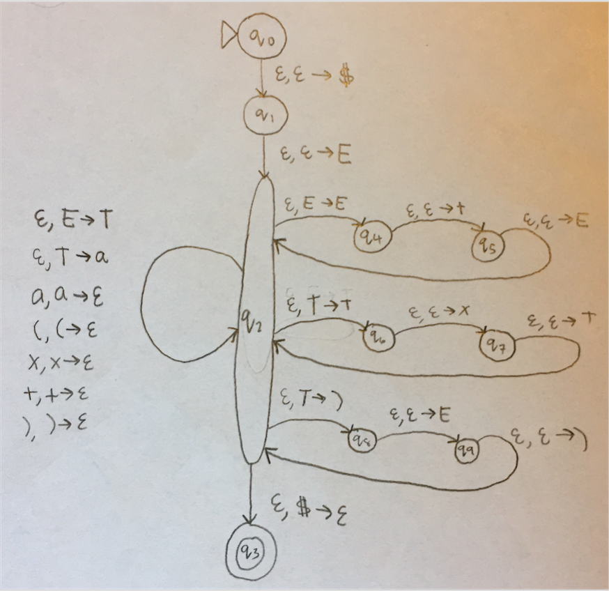
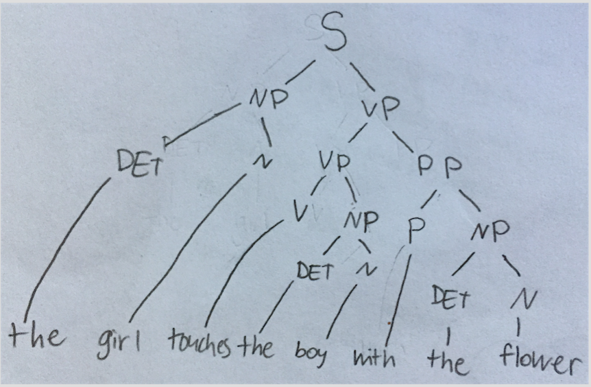
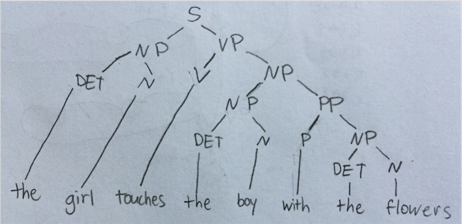

# FOCS Homework 10, for Day 11

You may edit your answers into this file, or add a separate file in the same directory.

If you add a separate file, please include the following at the top:

```
Student Name: Jordan Van Duyne
Check one:
[ ] I completed this assignment without assistance or external resources.
[x] I completed this assignment with assistance from the textbook
   and/or using these external resources: ___
```

## I. Logic

### 1.

The following tables are [truth tables](https://en.wikipedia.org/wiki/Truth_table).

_true_ and _false_ are represented by `T` and `F`. _OR(false, true)_ is commonly written in [infix notation](https://en.wikipedia.org/wiki/Infix_notation): `F OR T`.

The second table shows the value of the function _a OR b_, for all possible values _a_ and _b_. For example, _false OR true_ (the second row) has the value _true_ (the final cell of that row).

_a_ | _b_ | _a_ AND _b_
----|-----|---
 F  |  F  | F
 F  |  T  | F
 T  |  F  | F
 T  |  T  | T

_a_ | _b_ | _a_ OR _b_
----|-----|---
 F  |  F  | F
 F  |  T  | T
 T  |  F  | T
 T  |  T  | T

_a_ | _b_ | _a_ XOR _b_
----|-----|---
 F  |  F  | F
 F  |  T  | T
 T  |  F  | T
 T  |  T  | F

a. Construct the truth table for _a XOR (b XOR a)_.

_b XOR a = a XOR b_

_a_ | _b_ | _a_ XOR _b_ | _a XOR (b XOR a)_
----|-----|-------------|------------------
 F  |  F  | F           | F
 F  |  T  | T           | T
 T  |  F  | T           | F
 T  |  T  | F           | T

b. Which function corresponds to the English word "or", as used in "You will eat your meat OR you can't have any pudding" (where _a_ = "You will eat your meat" and _b_ = "you can't have any pudding").

XOR corresponds to the English word "or" because normally when the word "or" is used, such as in that example, it means one or the other, but not both. The logical OR will be true if at least one of {a,b} is true, meaning both can be true. XOR is true if and only if exactly one of {a,b} is true.

## II. Questions 2–6 are the same as in-class activities 2-6

### 2.

Consider the following context-free grammar G:

```
E -> E + E | T         # <- added "| T"
T -> T x T | (E) | a
```

Convert G to a PDA.



### 3.

Convert grammar G from (2) to Chomsky Normal Form.

```
S_o → E
E   → a | EE_1
T   → TT_1 | LT_2
E_1 → PE
T_1 → XT
T_2 → ER
P   → +
X   → x
L   → (
R   → )
```


### 4.

Is the grammar G's language a regular language? If yes, produce a FSA or regular expression for this language. If not, show this.

No, this language is not regular. Since one of the rules yields (E), this means that the language has to be able to match infinite parenthesis (for example the string (<sup>n</sup>a)<sup>n</sup> ) which a regular language is unable to do since a regular language only has finite memory.

If we assume for contradiction that this language, which will be called *L*, is regular. By the pumping lemma, there is some length *p* such that all words *w* in the language of length *p* or greater can be pumped.

Let *s* be the string (<sup>p</sup>a)<sup>p</sup>. Since |*s*| = *2p + 1 ≥ p*, the pumping lemma guarantees that *s* can be split into three pieces *s = xyz*, where for any *i ≥ 0*, the string *xy<sup>i</sup>z* is in *L*.

By the pumping lemma, |*xy*| ≤ *p*, so *xy* has to be a subset of *(<sup>p</sup>*, meaning *x = (<sup>j</sup>* and *y = (<sup>k</sup>*, where *j + k ≤ p* and *k > 0* since |*y*| > *0* by the pumping lemma. Thus, *z = (<sup>p-j-k</sup>a)<sup>p</sup>*. If we pump *y* so that *i = 0*, we have are left with *xz*, where *xz = (<sup>p-k</sup>a)<sup>p</sup>*, which is not in *L*. Thus we have a contradiction! *L* cannot be regular.


### 5.

Theorem 1: The language {a^n b^n c^n} is not a context-free language.

a. Use Theorem 1, together with the languages {a^i b^i c^j} and {a^i b^j c^j}, to show that the set of context-free languages is not closed under intersection.

Both {a^i b^i c^j} and {a^i b^j c^j} are both context-free languages (they can be represented by G<sub>1</sub> and G<sub>2</sub>, below). Their intersection is {a^n b^n c^n}. However, since {a^n b^n c^n} is not a CFL, the set of CFLs is not closed under intersection since the intersection of these two CFLs is not a CFL.

{a^i b^i c^j} can be represented by grammar G<sub>1</sub>:

```
A → aAb | C
C → cC | ε
```

and {a^i b^j c^j} can be represented by grammar G<sub>2</sub>:

```
A → aA | B
B → bBc | ε
```

b. Use the pumping lemma for context-free languages [Sipser pp. 125] to prove Theorem 1.

For contradiction, assume that the language *L*, {a^n b^n c^n}, is a CFL. By the pumping lemma, there is a length *p* for which any string of at least length *p* that is in *L* can be pumped and remain in *L*.

Let *s* be the string a<sup>p</sup>b<sup>p</sup>c<sup>p</sup>. *s* is a member of *L* and is of length *3p > p*. The pumping lemma states that *s* can be divided into *uvxyz* where for *i ≥ 0*, *uv<sup>i</sup>xy<sup>i</sup>z* is in *L*. Furthermore |*vy*| *> 0*.

Case 1: Suppose both *v* and *y* each contain only one type of letter. Then, if *s* is pumped to *i = 2*, then the string is *uv<sup>2</sup>xy<sup>2</sup>z*, where there are now not an equal number of each type of letter since at most only two letters were increased in length. Therefore it cannot be in *L* and there is a contradiction.

Case 2: If *v* and *y* contain multiple letters, then pumping *v* and *y* results in an incorrect order of letters, since whatever is the first letter in *v* or *y* cannot appear after the second letter in *v* or *y*, but pumping would cause this to happen. Therefore, this pumped string cannot be in *L* and there is a contradiction.

Since one of these cases has to happen, there is a contradiction and therefore *L* is not a CFL.

### 6.

Consider the context-free grammar G:

```
S -> NP VP
NP -> NP PP
NP -> DET N
VP -> V NP
VP -> VP PP
DET -> a | the
N -> boy | girl | flowers | binoculars
V -> touches | sees
PP -> P NP
P -> in | from | with
```

a. Show that the string "the girl touches the boy with the flower" has two
different leftmost derivations.

**Derivation 1**

S → NP VP → DET N VP → the N VP → the girl VP → the girl VP PP → the girl V NP PP → the girl touches NP PP → the girl touches DET N PP → the girl touches the N PP → the girl touches the boy PP → the girl touches the boy P NP → the girl touches the boy with NP → the girl touches the boy with DET N → the girl touches the boy with the N → the girl touches the boy with the flower

**Derivation 2**

S → NP VP → DET N VP → the N VP → the girl VP → the girl V NP → the girl touches NP → the girl touches NP PP → the girl touches DET N PP → the girl touches the N PP → the girl touches the boy PP → the girl touches the boy P NP → the girl touches the boy with NP → the girl touches the boy with DET N → the girl touches with boy with the → the girl touches the boy with the flower

b. Describe in English the two different meanings of this sentence.

The first derivation means that the girl uses flowers to touch the boy. The second derivation means that the girl touches a boy, and that boy has flowers.

c. Use G to generate another ambiguous sentence.
a boy sees the flowers with the binoculars

d. Modify G so that it generates strings with adjectives: `the girl saw the tall boy`, `the girl touches the boy with a purple flower`.

```
S -> NP VP
NP -> NP PP
NP -> DET N | DET ADJP
ADJP -> ADJ N
ADJ -> tall | purple
VP -> V NP
VP -> VP PP
DET -> a | the
N -> boy | girl | flowers | binoculars
V -> touches | sees
PP -> P NP
P -> in | from | with
```


You don't need to know this, but here's how the variable names relate to linguistics.

Variable | meaning
---|---
S | sentence
DET | determiner (article)
N | noun
NP | noun phrase
P | preposition
PP | prepositional phrase
V | verb
VP | verb phrase

[Adapted from Sipser 2.8.]
