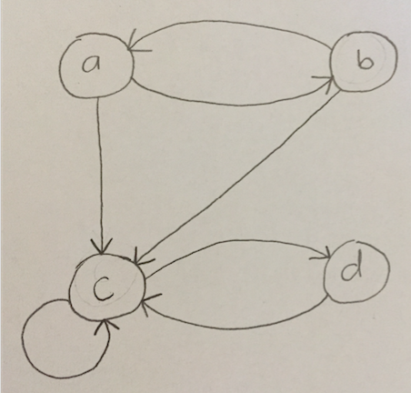

# FOCS Homework 19

You may edit your answers into this file, or add a separate file in the same directory.

If you add a separate file, please include the following at the top:

```
Student Name: Jordan Van Duyne
Check one:
[x] I completed this assignment without assistance or external resources.
[ ] I completed this assignment with assistance from ___
   and/or using these external resources: ___
```

## 0. [Not a question] Terminology

In class on Monday, we drew [**call graphs**](https://en.wikipedia.org/wiki/Call_graph) of the `fib` function, with and without memoization.

This particular kind of call graph is a **dynamic call graph**, whose nodes are function *invocations* during the execution of a program. The nodes of a **static call graph** are function *names*; arrows indicate appearances of a call in the program source text.

A dynamic call graph of a *recursive* function is also called a **recursion graph**.

## 1. Predicate Calculus – Models

Consider Table 1:

| x    | y    |
| ---- | ---- |
| a    | b    |
| b    | c    |
| a    | c    |
| c    | d    |
| d    | c    |
| c    | c    |
| b    | a    |

*Table 1*: A model for `loves(x, y)`

a. For each of the following, is Table 1 a model?  Explain briefly why or why not.

1. ∃x. ∀y. loves(x, y)

  Table 1 is not a model. This would mean that there is at least one person in x who loves everyone else in y. This is not true because the only person who loves d is c, but c only loves c and d, not also b and a.

2. ∃y. ∀x. loves(x, y)

  Table 1 is a model. This means that there are rows in the table relating every possible x to some given value of y. This is true for y=c.

3. ∀x. ∃y. loves(x, y)

  Table 1 is a model. Every single person in the database loves at least one person. (every person in the database appears at least once in the x column)

4. ∀y. ∃x. loves(x, y)

  Table 1 is a model. Everyone in the database is loved by at least one person; every person in the database appears at least once in the y column.

5. ∃x. ∃y. loves(x, y)

  Table 1 is a model. There is someone who loves some; this is shown by Table 1 because there is at least one row in Table 1 relating some value of x to some value of y.

6. ∃x. ∀y. ¬loves(x, y)

  Table 1 is not a model. Every person loves at least one other person (in Table 1, however, every person in the database appears at least once in the x column, meaning that there is no person who loves no one).

7. ∃x. ¬∀y. loves(x, y)

  Table 1 is a model. There is at least one person who does not love everyone (for example, a does not love d, meaning that a does not love all possible values of y).

b. Consider three models: (i) objects are a, b, c, d; `loves` is Table 1; (ii) objects are integers; `loves(x, y) ` ≝ x ≧ y; (iii) `loves(x, y)` ≝ x = y. In which of these models are these statements true:

| Statement                                | Table 1 | x ≧ y | x = y |
| ---------------------------------------- | ------- | ----- | ----- |
| ∀x, x. loves(x, x)                       |    F     |   T    |   T    |
| ∀x, y. loves(x, y) → loves(y, x)         |    F     |   F    |   T    |
| ∀x, y, z. loves(x, y) ∧ loves(y, z) → loves(x, z) |    F     |   T    |    T   |

c. (Optional) (Because we love graphs) Draw Table 1 as a digraph. What claims do each of the following make about a node x or y, in terms of its indegree and outdegree?



1. ∀x. loves(x, y)

  Every node has an outdegree representative of whatever is being said about y. (for ex, if y is considered to be the same y node for all x nodes, then all x have an outdegree of at least 1).

2. ∀y. loves(x, y)

  Every node has an indegree representative of whatever is being said about x.

3. ∃x. loves(x, y)

  At least one node has an outdegree representative of whatever is being said about y.

4. ∃y. loves(x, y)

  At least one node has an indegree representative of whatever is being said about x.

## 2. Predicate Calculus – Proofs

Given axioms:

1. ∀x. sum( x, 0, x )
2. ∀x, y, z. sum( x, y, z ) → sum( x, s(y), s(z) )
3. ∀x . product( x, 0, 0 )
4. ∀x, y, z, k. product( x, y, z ) ∧  sum( x, z, k ) → product( x, s(y), k )

Prove:

1.  ∃x. sum( x, x, s(s(0)) )

  1. sum(s(0), 0, s(0)); a
  2. sum(s(0), s(0), s(s(0))); 1, b

      Thus, for x = s(0), sum( x, x, s(s(0)) ) holds

2.  ∀x. sum( 0, x, x ) [hint:  induction]

  Let P(n) = 'the truth of the statement sum(0, s<sup>n</sup>(0), s<sup>n</sup>(0)), where s<sup>n</sup>(x) means that s is called recursively on 0 n times (ex: s<sup>1</sup>(x) = s(0), s<sup>2</sup>(x) = s(s(0)))'

  **Base:**

  n = 0:

    sum(0, 0, 0); true by axiom 1

  n = 1:

    sum(0, s(0), s(0)); true by base case n=0 and axiom 2

  **Inductive hypothesis:** Suppose P(0), P(1), ..., P(k) is true for some k ≥ 1.

  **Inductive step:** Consider P(k + 1); consider that sum(0, s<sup>k+1</sup>(0), s<sup>k+1</sup>(0)) is true. By the inductive hypothesis, sum(0, s<sup>k</sup>(0), s<sup>k</sup>(0)) is true. By axiom 2, since P(k) holds, P(k+1) also holds.

  Since the base cases n=0 and n=1 hold and since the truth of all P(n) up to some n ≥ 1 implies the truth of P(n+1), this statement is true for all n ≥ 0. 


3.  [optional super-challenge] ∀x, y, z. sum( x, y, z ) → sum( y, x, z )

## 3. Maximum Subarray

The [maximum subarray problem](https://en.wikipedia.org/wiki/Maximum_subarray_problem) (*aka* maximum contiguous subsequence, *aka* maximum value contiguous subsequence) is “the task of finding the contiguous subarray within a one-dimensional array of numbers which has the largest sum. For example, for the sequence of values −2, 1, −3, 4, −1, 2, 1, −5, 4; the contiguous subarray with the largest sum is 4, −1, 2, 1, with sum 6” ([Wikipedia](https://en.wikipedia.org/wiki/)).

```python
# Source: wikipedia
def max_subarray(xs):
    max_ending_here = max_so_far = 0
    for x in xs:
        max_ending_here = max(0, max_ending_here + x)
        max_so_far = max(max_so_far, max_ending_here)
    return max_so_far
```

a. Draw a recursion graph of `max_subarray([−2, 1, −3, 4, −1, 2, 1, −5, 4])`.

This implementation of `max_subarray` isn't recursive, so there is only one call to `max_subarray`, the original call...

b. Is `max_subarray` an example of divide and conquer? Why or why not?

No. A divide and conquer algorithm would break the problem into independent subproblems and build an overall solution from the answers to those subproblems. This implementation of `max_subarray` does not do that. A divide and conquer implementation split the array into two subarrays and (recursively) find their max-subarrays and use those two max-subarrays to find the max-subarray of the entire array.

c. Is `max_subarray` an example of dynamic programming? Why or why not?

Yes. This implementation takes advantage of the overlapping subproblems (finding the largest subarray from the multiple subarrays that end at a given element) and uses the answers to these smaller subproblems to build up answers to the next subproblem, ultimately creating the overall solution.

d. Consider a *memoized* version of `max_subarray`. (You don't need to produce code for this. You do need to understand what memoization does to a call graph.) Draw the recursion graph for `memoized_max_subarray([−2, 1, −3, 4, −1, 2, 1, −5, 4])`.

e. [Optional challenge] Produce working code for memoized `max_subarray`.

## 4. Binary Search

```python
def binary_search_array_helper(x, xs, left, right):
    if left == right: return None
    middle = int((left + right) / 2)
    if x < xs[middle]:
        return binary_search_array_helper(x, xs, left, middle)
    elif xs[middle] < x:
        return binary_search_array_helper(x, xs, middle, right)
    else:
        return middle

def binary_search_array(x, xs):
    return binary_search_array_helper(x, xs, 0, len(xs))
```

a. Above is an implementation of the [binary search algorithm](https://en.wikipedia.org/wiki/Binary_search_algorithm). Draw the recursion graph for `binary_search_array(3, [1, 3, 4, 6, 7, 8, 10, 13, 14]))`.

```
binary_search_array(3, [1, 3, 4, 6, 7, 8, 10, 13, 14])
                        |
binary_search_array_helper(3, [1, 3, 4, 6, 7, 8, 10, 13, 14], 0, 9)
                        |
binary_search_array_helper(3, [1, 3, 4, 6, 7, 8, 10, 13, 14], 0, 4)
                        |
binary_search_array_helper(3, [1, 3, 4, 6, 7, 8, 10, 13, 14], 0, 2)
```


b. Is `binary_search_array` an example of divide and conquer? Why or why not?

Although `binary_search_array_helper` ends up breaking the problem into smaller problems (diving the array into a subarrays and then recursively searching one of the subarrays), the solutions to the smaller problems are not combined to conquer the overall solution. The algorithm just divides the problem into subproblems (divide), but the conquer part does not combine the solutions of the divide part.

c. Is `binary_search_array` an example of dynamic programming? Why or why not?

`binary_search_array` is not an example of dynamic programming. It does not solve any overlapping subproblems to solve the overlapping problem. Yes, it does check which half of the subarray the element is in, but problems aren't exactly overlapping; there is no optimal substructure.

d. Consider a memoized version of `binary_binary_search_array_helper`. Draw the recursion graph for a function memoized `memoized_binary_search_array(3, [1, 3, 4, 6, 7, 8, 10, 13, 14]))` that calls `memoized_binary_search_array_helper`.

```
memoized_binary_search_array(3, [1, 3, 4, 6, 7, 8, 10, 13, 14])
                            |
memoized_binary_search_array_helper(3, [1, 3, 4, 6, 7, 8, 10, 13, 14], 0, 9)
                            |
binary_search_array_helper_for_memoization(3, [1, 3, 4, 6, 7, 8, 10, 13, 14], 0, 9)
                            |
memoized_binary_search_array_helper(3, [1, 3, 4, 6, 7, 8, 10, 13, 14], 0, 4)
                            |
binary_search_array_helper_for_memoization(3, [1, 3, 4, 6, 7, 8, 10, 13, 14], 0, 4)
                            |
memoized_binary_search_array_helper(3, [1, 3, 4, 6, 7, 8, 10, 13, 14], 0, 2)
```

e. Under what circumstances does the `memoized_binary_search_array` present any benefits over the unmemoized original? How does this relate to (i) its recursion graph; (ii) the key attributes of a dynamic program?

If the given value has already been searched for by a a previous call of `memoized_binary_search_array`, then the index of the element will be stored in the memoization hash, so none of the recursive calls are made. `memoized_binary_search_array` makes one call to `memoized_binary_search_array_helper`, which looks up and returns the index in the hash. Thus, in this case the recursion graph would be much shorter: it only has a depth of 2. This version is much more similar to dynamic programming because the result of a problem is stored and can be used to solve another problem (such as if the element is search for again).

f. [Optional challenge] Find the bug in `binary_search_array`. What input will cause it to fail? How can this be fixed? (Hint: it is a bug that appears for small arrays. Python is not susceptible to [this bug](https://research.googleblog.com/2006/06/extra-extra-read-all-about-it-nearly.html).)

## 5. Datalog Tutorial

Done!

Dust off your DrRacket, and follow the Datalog tutorial [here](https://docs.racket-lang.org/datalog/Tutorial.html).

## 6. SQL

Done!

Install [SQLite](https://www.sqlite.org):

* **Linux**: `sudo apt-get install sqlite`
* **macOS** (w/ [homebrew](http://brew.sh)): `brew install sqlite3`
* **Windows**; **macOS** (w/out homebrew): download the pre-compiled binary from the [SQLite Download Page](https://sqlite.org/download.html)

Kick its tires:

```
$ sqlite3
SQLite version 3.13.0 2016-05-18 10:57:30
Enter ".help" for usage hints.
Connected to a transient in-memory database.
Use ".open FILENAME" to reopen on a persistent database.
sqlite> create table course(title string, number string, area string, credits int);
sqlite> insert into course values ("FOCS", "ENGR3520", "ENGR", 4);
sqlite> insert into course values ("SoftDes", "ENGR2510", "ENGR", 4);
sqlite> insert into course values ("Discrete", "MTH2110", "MTH", 4);
sqlite> .mode column
sqlite> .headers on
sqlite> select * from course;
title       number      area        credits
----------  ----------  ----------  ----------
FOCS        ENGR3520    ENGR        4
SoftDes     ENGR2510    ENGR        4
Discrete    MTH2110     MTH         4
sqlite> select * from course where area="ENGR";
title       number      area        credits
----------  ----------  ----------  ----------
FOCS        ENGR3520    ENGR        4
SoftDes     ENGR2510    ENGR        4
sqlite> .quit
```
