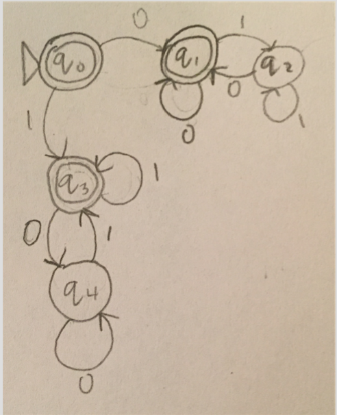
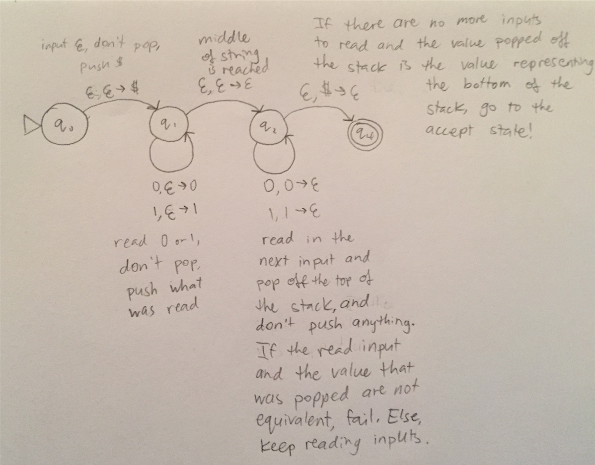

Student Name: Jordan Van Duyne
Check one:
[x] I completed this assignment without assistance or external resources.
[ ] I completed this assignment with assistance from \_\_\_
   and/or using these external resources: ___

## 1. For each of the following languages, decide whether it is regular

a) Strings containing only the symbol a whose length is a power of 2 (i.e. length 2^n)

[The strings a, aa, aaaa, and aaaaaaaa are in this language; the string aaaaa is not.]

Not regular.

Assume for contradiction that this language, *L*, is regular.

By the pumping lemma, there is some length *p* such that all words *w* in *L* of length *p* or greater can be pumped.

Let *s* be the string a2p. Thus, the length of *s* is greater than *p*, since for any positive power *j* of 2, *2j > j* (1, 2, 4, 8, 16 are the values of 2 to the 0, 1, 2, ..., 4, respectively, and the values continue growing exponentially, while the exponents only increase by 1). The pumping lemma therefore guarantees that *s* can be split into three pieces *s = xyz*, where for any *i* ≥ 0, the string *xyiz* is in *L*.

Consider the strings *xyz* and *xyyz*, where *xyyz* should be the word in *L* where *n* is one greater than in *xyz*; so *s = xyz* and a2p + 1 = *xyyz*. These strings differ from each other by a single repetition of *y*, so their lengths differ by |*y*|.

By the pumping lemma, |*xy*| ≤ *p*, and thus |*y*| ≤ *p* since |*x*| ≥ 0. The pumping lemma also guarantees that *y* is not the empty string.

We have |*xyz*| = *2p*, so |*xyyz*| ≤ *2p + p*. However, *2p + 1 = 2p +  2p > 2p + p* (as shown above). So, |*xyyz*| is between *2p* and *2p + 1*, meaning that the length of |*xyyz*| cannot be *2j*, so we have a contradiction! Thus, *xyyz* is not in *L*, meaning *L* cannot be regular.

b) All strings with an equal number of occurrences of the substrings 01 and 10.

(assuming ∑ = {0,1})

(0+(1+0+)\*)\*|(1+(0+1+)\*)*

c) All strings (over {0,1}) consisting of a substring w followed by the reverse of the substring.

Not regular.

Assume for contradiction that this language, *L*, is regular.

By the pumping lemma, there is some length *p* such that all words *w* in *L* of length *p* or greater can be pumped.

Let *s* be the string *0p110p*. Since |*s*| = *2p + 2 ≥ p*, the pumping lemma guarantees that *s* can be split into three pieces *s = xyz*, where for any *i ≥ 0*, the string *xyiz* is in *L*.

By the pumping lemma, |*xy*| ≤ *p*, so *xy* has to be a subset of *0p*, meaning *x = 0j* and *y = 0k*, where *j + k ≤ p* and *k > 0* since |*y*| > *0* by the pumping lemma. Thus, *z = 0p-j-k110p*. If we pump *y* so that *i = 0*, we have are left with *xz*, where *xz = 0p-k110p*, which is not in *L*. Thus we have a contradiction! *L* cannot be regular.

## 2. Play the pumping game

### Exercise 1

* L={w∈Σ\* | |w|𝕒<|w|𝕓}; p = 8

* My word: aaaabbbbb (a4b5)

* Substring (italicized section): aaaa*b*bbbb

* Pumped string: aaaabbbb (a4b4)

### Exercise 15

* L={anbn2 | n∈ℕ}; p = 6

* My word: aaabbbbbbbbb (a3b9)

* Substring (italicized section): aaa*bbbb*bbbbb

* Pumped string: aaabbbbbbbbbbbbb (a3b13)

## 3. Create a PDA
 

## 4. Reading

Read Sipser!

## 5. Install gprolog

Done!
