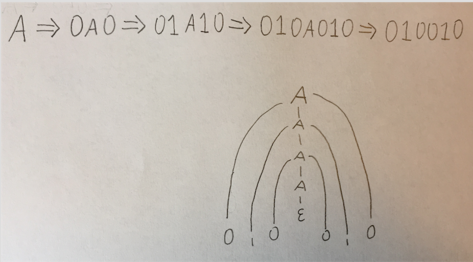
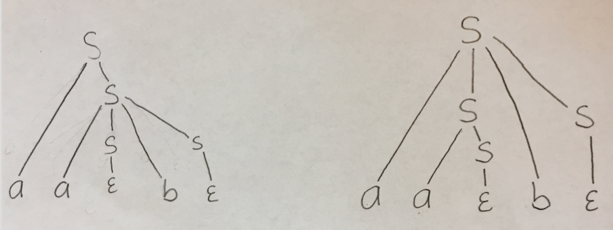

Student Name: Jordan Van Duyne
Check one:
[x] I completed this assignment without assistance or external resources.
[ ] I completed this assignment with assistance from ___
   and/or using these external resources: ___


## 1. Reading

Done!

## 2. Constructing Grammars

### a) All strings (over {0,1}) consisting of a substring w followed by its reverse. (This is the same problem you were asked to work on in class.)

```
A → 0A0 | 1A1 | ε
```

#### Give a derivation for 010010.

```
A → 0A0 → 01A10 → 010A010 → 010010
```
(ε in last transition)



### b) All strings (over {a,b,c}) of the form a^{i}b^{i}c^{j}: an equal number of as and bs, followed by any number of cs. For example, aabb, aabbcc, and aabbcccc, but not aaaabbcc.

```
A → 0A1 | C
C → cC | ε
```

### c) All strings (over {a,b,c}) of the form a^{i}b^{j}c^{j}: any number of as, followed by an equal number of bs and cs. For example, abbcc, aabbcc, and aaaabbcc, but not aabbccc.


```
A → aA | B
B → bBc | ε
```

### d) Give two distinct grammars that produce the strings described by the regular expression (ab)\*: empty, ab, abab, ababab, ….

G1:

```
A → abA | ε
```

G2:

```
A → aB | ε
B → bA
```

## 4. Ambiguous Grammars
(there was no #3 on this hw... jumped from 2 to 4)

### a. parse trees


### b. leftmost derivations (These are the ones that, starting from the start variable, rewrite the leftmost nonterminal first.)

First:

```
S → aS → aaSbS → aabS (replace leftmost S with ε) → aab (replace remaining S with ε)
```

Second:

```
S → aSbS → aaSbS → aabS (replace leftmost S with ε) → aab (replace remaining S with ε)
```

### c. rightmost derivations (These are the ones that, starting from the start variable, rewrite the rightmost nonterminal first.)

First:

```
S → aS → aaSbS → aaSb (replace rightmost S with ε) → aab (replace remaining S with ε)
```

Second:

```
S → aSbS → aSb (replace rightmost S with ε) → aaSb → aab (replace remaining S with ε)
```

## 5. [Optional] Play with Prolog

Optional!
